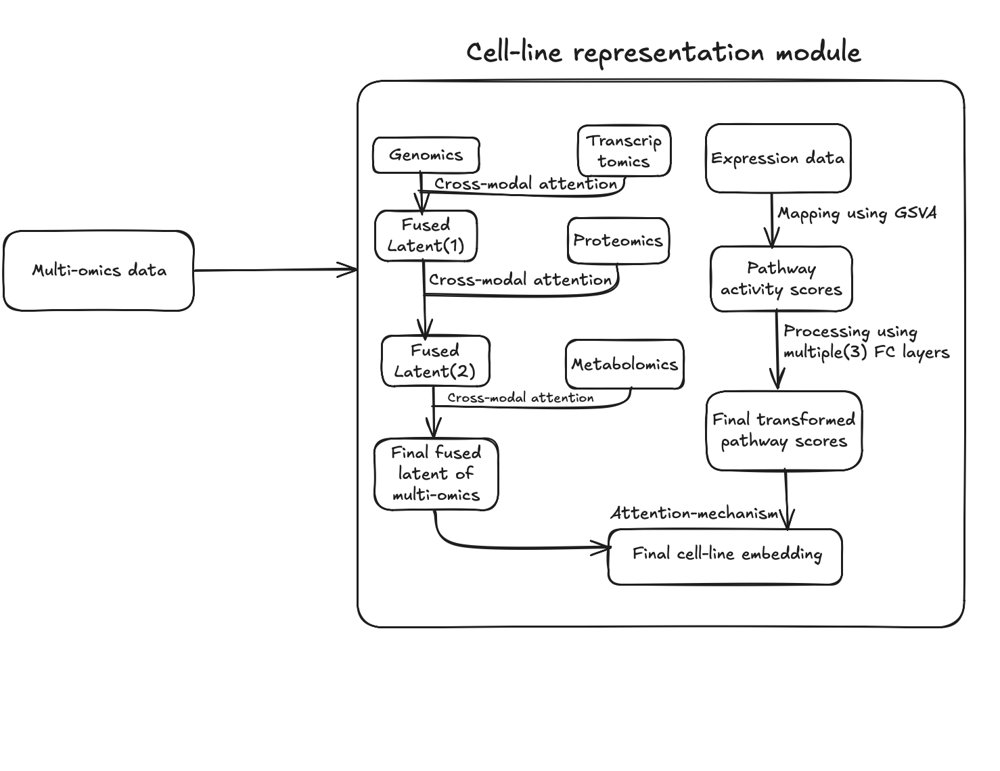
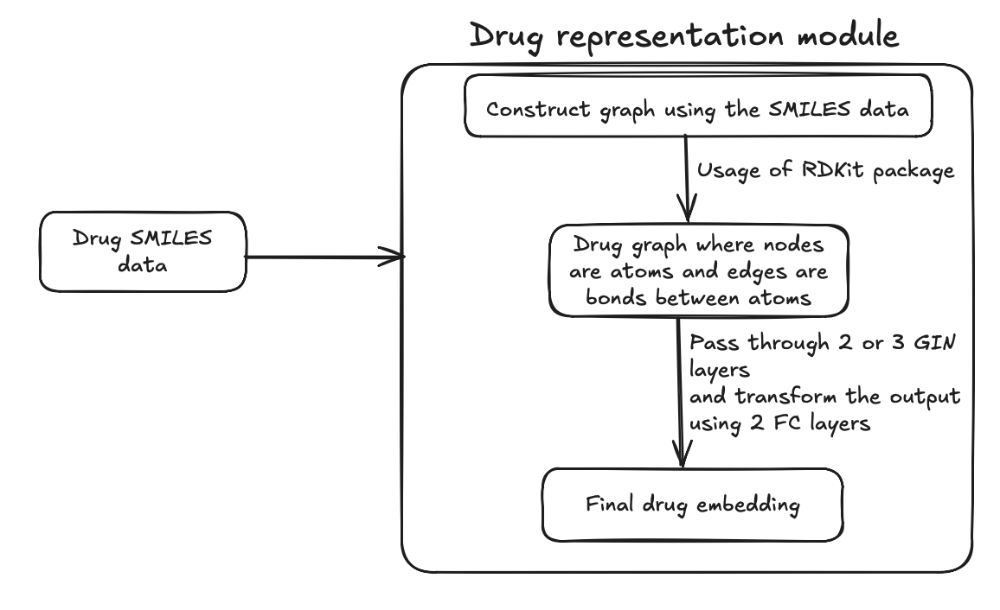
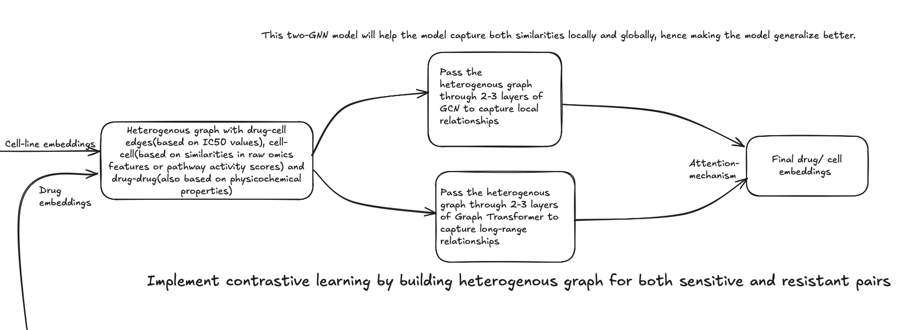
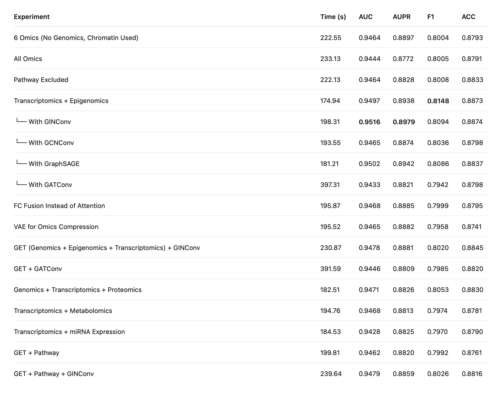
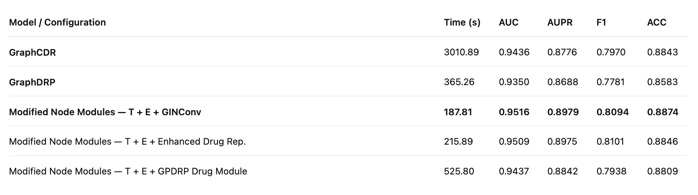
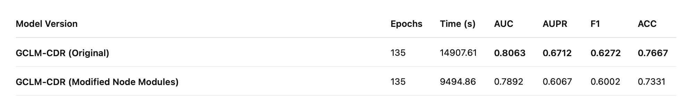
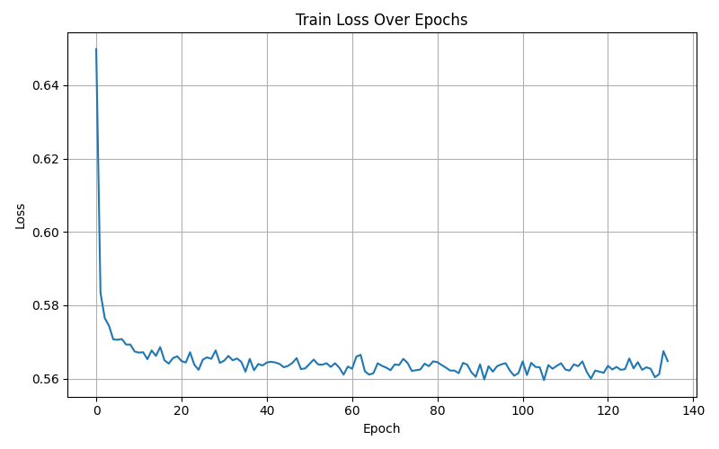
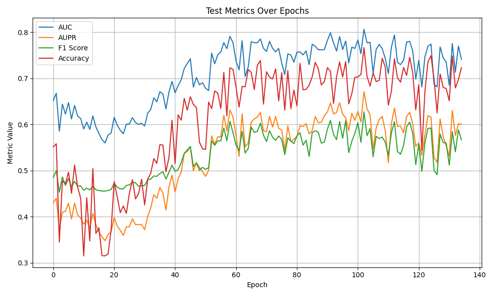

# Cancer Drug Response Prediction (CDRP) using Graph Neural Networks

**Author:** Hrishikesh Kurapati (S20230010132)  
**Guide:** Dr. Amilpur Santosh  
**Institution:** IIIT Sri City  
**Date:** 8 December 2025

---

## 1. Introduction & Overview

### What is CDRP?
Cancer Drug Response Prediction (CDRP) aims to forecast how cancer cells or patients will respond to specific drugs using computational models. By leveraging biological data (omics) and chemical data (drugs), these models predict sensitivity or resistance.

### Why it Matters
Cancer treatment responses vary widely between patients. Accurate predictions enable faster drug discovery, reduce trial-and-error in treatments, and improve clinical decision-making for personalized therapy.

### Project Roadmap
- **Phase 1 (Current):** Build drug and cell-line representation modules.
- **Phase 2:** Drug-cell processing + contrastive learning.
- **Phase 3:** Fine-tune on in-vivo data, pretraining.
- **Phase 4:** Add explainability and extensions.

---

## 2. References (Baseline Models)

The following papers were reviewed and used as baselines for this project:

1.  **GraphCDR**: *GraphCDR: A GNN method with contrastive learning for CDR (2022)*
    -   Source: `Reviewed Research Papers/2022_GraphCDR a GNN method with contrastive learning for CDR.pdf`
2.  **GCLM-CDR**: *GCLM-CDR: A graph contrastive learning method with multi-omics for cancer drug response prediction (2024)*
    -   Source: `Reviewed Research Papers/2024_GCLM-CDR_a_graph_contrastive_learning_method_with_multi-omics_for_cancer_drug_response_prediction.pdf`

---

## 3. Basic Terminology

1.  **Omics**: System-wide study of cell components. We use:
    *   **Genomics**: Mutation data.
    *   **Transcriptomics**: Gene expression.
    *   **Epigenomics**: Methylation & Chromatin profiling.
    *   **Proteomics**: Protein abundance.
    *   **Metabolomics**: Metabolic levels.
2.  **Drug SMILES**: String representation of chemical structure, converted into molecular graphs.
3.  **Cross-modal Attention**: Mechanism to focus on relevant information across different modalities (e.g., genomics vs. drug graphs).
4.  **Graph Neural Networks (GNNs)**: Neural networks designed for graph data (GCN, GAT, GIN).

*Figure 1: Cell-Line Representation Module*

---

## 3. Work Done: Node Representation Modules

I have developed novel **Node Representation Modules** that determine how drug and cell-line nodes are embedded in the graph before GNN processing.

### Architecture Highlights
-   **Drug Representation**: Uses **GIN (Graph Isomorphism Network)** layers to process molecular graphs constructed from SMILES data.
-   **Cell-Line Representation**: Fuses multiple omics data sources using **Cross-Modal Attention**.
-   **Integration**: These embeddings are fed into the main **GraphCDR** pipeline.

*Figure 2: Drug Representation Module*

*Figure 3: Overall CDRP Pipeline*

---

## 4. Code Explanation

 The source code is organized in the `src/` directory. Here is an overview of the key components:

### Core Models
-   **`src/model_GCLM_CDR.py`**: Contains the GCLM-CDR architecture and variants, including VAEs for omics compression and the graph transformer.
-   **`src/model.py`**: Contains the modified GraphCDR model architecture with flexible GNN backbones (GCN, GAT, GIN) for drug representation modules.
-   **`src/model_baseline.py`**: Contains the original GraphCDR model implementation used for benchmarking.

### Experiment Runner
-   **`src/graphCDR_node_representation_modified.py`**: The main script for running experiments, handling data loading, model initialization, and the training/testing loops.

### Data Handling
-   **`src/data_load.py` & `src/data_process.py`**: Handles dataset loading (CCLE, GDSC), preprocessing, graph construction, and splitting functionality.

---

## 5. Dataset Preparation

We utilized data from:
-   **CCLE (DepMap)**: For cell-line omics (Mutation, Methylation, Gene Expression).
-   **GDSC**: For drug response (IC50) and chemical features.
-   **PubChem**: For drug SMILES strings.

**Preprocessing Steps:**
1.  **Imputation**: KNN imputation for missing values (<5%).
2.  **Unified IDs**: Mapped all entities to a common ID structure.
3.  **Graph Features**: Precomputed atom features (26 atoms, 75 features) and adjacency lists for drugs.

*Figure 4: Data Processing Flow*

---

## 6. Experimental Setup

-   **Modalities**: Epigenomics, Transcriptomics, Drug Atom Features.
-   **Data Scale**: 229 drug features, 537 cell lines, 5 omics types.
-   **Pairs**: 87,199 drug-cell pairs (derived from 111,248 raw rows).
-   **Training Config**:
    -   Optimizer: Adam (lr=0.001)
    -   Batch Size: 64
    -   Epochs: 200 (Baseline GCLM-CDR: 135)
    -   Split: 90% Train / 10% Test (Seed: 666)

---

## 7. Results

### Performance Comparison
Our modified node representation module significantly outperforms the baselines.

**Best Model Configuration:**
`Transcriptomics + Epigenomics + GINConv`

| Metric | Score |
| :--- | :--- |
| **AUC** | **0.9516** |
| **AUPR** | **0.8979** |
| **F1** | **0.8094** |
| **Accuracy** | **0.8874** |

*Figure 5: Performance of Modified GraphCDR Variants*

### Comparison with Other Models
Our model demonstrates the highest AUC and AUPR while maintaining the fastest runtime among competitive models.

*Figure 6: Comparison with Baseline Models*

### GCLM-CDR Variants
The modified architecture shows more stable training convergence compared to the original GCLM-CDR.

*Figure 7: GCLM-CDR Variants Performance*

### Training Curves
Evidence of faster convergence and lower loss with the modified architecture.

  
   

*Figure 8: Training Loss and Test Metrics Curves*

---

## 8. Conclusion

-   **GraphCDR** and **GraphDRP** serve as strong baselines.
-   **Modified Node Representation Modules** (using GINConv + Cross-Modal Attention) outperform all baselines.
-   **Key Win**: Significantly reduced training time while achieving richer feature learning (AUC 0.9516).

---

## 9. Future Work

-   **Near Term**: Implement contrastive learning for better alignment of drug and cell-line spaces.
-   **Mid Term**: Fine-tune on in-vivo data.
-   **Long Term**: Add explainability modules to interpret *why* a drug is effective.

.png)
*Figure 9: Proposed Contrastive Learning Framework*