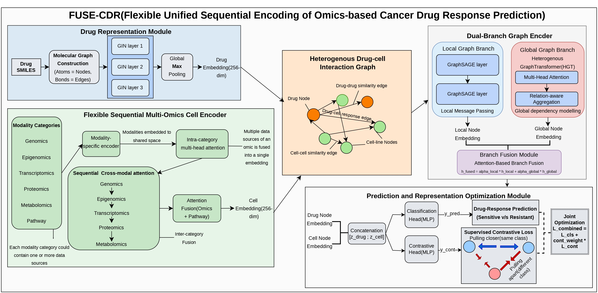

# FUSE-CDR (Flexible Unified Sequential Encoding of Omics-Based Cancer Drug Response Prediction)

**Author:** Hrishikesh Kurapati  
**Institution:** IIIT Sri City  
**Guide/Supervisor:** Dr. Amilpur Santhosh  

---

## 🚀 Overview

**FUSE-CDR** is a flexible heterogeneous graph learning framework designed to predict cancer drug responses. It achieves this by combining **hierarchical multi-omics fusion** with **dual-branch graph representation learning** (GraphSAGE and HGT), specifically modeling the intricate relationships between different omics layers, drugs, and cancer cell lines.

**Key Contributions:**
*   **Heterogeneous Graph Construction:** Explicitly models drug–drug, cell–cell, and drug–cell edges, bridging seen and unseen entities.
*   **Hierarchical Multi-Omics Fusion:** Employs a cross-modal sequential attention mechanism aligning with biological regulatory structures to fuse up to 6 omics modalities.
*   **Dual-Branch Encoder:** Merges local structural pattern recognition (GraphSAGE) with global long-range dependency modeling (Heterogeneous Graph Transformer).
*   **Supervised Contrastive Learning (SCL):** Increases representation robustness, pulling matching response pairs together and pushing mismatched pairs apart.

FUSE-CDR achieves a state-of-the-art **AUC of 0.9359** on the benchmark dataset random split and demonstrates robust inductive generalization with an **AUC of 0.5847** in the strictly disjoint "Unseen Both" setting. In comprehensive evaluations across 5 foundational baselines, this represents a **12.31% relative improvement** over GraphCDR and **1.35%** over RedCDR in inductive settings.

---

## 📖 Problem Context

### What is Cancer Drug Response Prediction (CDRP)?
CDRP is a core challenge in precision oncology. The goal is simple: given a specific **cancer cell line** and a **drug molecule**, predict the therapeutic sensitivity (e.g., sensitive or resistant, measured traditionally via metrics like IC50). 

### Why It Matters
Identifying effective drugs for individual patients accelerates drug discovery and supports personalized treatment strategies. However, existing methods struggle due to noisy high-dimensional multi-omics data, the complex heterogeneous nature of biological graphs (i.e. treating cells and drugs identically), and importantly, severely degraded generalization when predicting for completely novel drugs or cell lines (the inductive setting).

---

## 🗺️ Project Roadmap

*   [x] **Phase 1:** Representation learning
*   [x] **Phase 2 (Latest Completed):** Graph modeling + contrastive learning
*   [ ] **Phase 3:** Explainability
*   [ ] **Phase 4:** Clinical validation

---

## 🏗️ Architecture



FUSE-CDR is a heterogeneous graph-learning framework that jointly models molecular, biological, and relational information. The architecture consists of three main components:

1.  **Biologically-Guided Flexible Multi-Omics Cell Encoder:**
    *   **Intra-Modality Encoder:** Projects high-dimensional measurements (Genomics, Epigenomics, Transcriptomics, etc.) into compact latent representations using modality-specific blocks.
    *   **Intra-Category Attention:** Uses multi-head dot-product attention to capture interactions among related molecular signals within the same biological category.
    *   **Inter-Modality Sequential Fusion:** Integrates modalities following a biological hierarchy: **Genomics** $\rightarrow$ **Epigenomics** $\rightarrow$ **Transcriptomics** $\rightarrow$ **Metabolomics** $\rightarrow$ **Proteomics** $\rightarrow$ **Pathway**.
2.  **Heterogeneous Graph Constructor:**
    *   Integrates drug and cell embeddings into a unified graph $\mathcal{G} = (\mathcal{V}, \mathcal{E})$.
    *   Includes **Sensitive-only drug–cell interaction edges**, drug–drug similarity edges (Physicochemical), and cell–cell similarity edges (Pathway activity).
    *   Uses **Top-$k$ ($k=10$) cosine similarity** to constrain graph density.
3.  **Dual-Branch Heterogeneous Graph Encoder:**
    *   **Local Branch (GraphSAGE):** Captures neighborhood-level structural patterns and local interactions.
    *   **Global Branch (Heterogeneous Graph Transformer - HGT):** Employs relation-aware attention to model long-range dependencies and multi-relational semantics beyond direct neighbors.
    *   **Attention-Based Aggregation:** Dynamically balances local and global representations for context-aware final embeddings.

---

## 💻 Getting Started

This repository provides all code required to reproduce experimental setups, evaluate baselines, and develop further upon FUSE-CDR.

### 1. Requirements

Ensure you are running Python 3.11+ and PyTorch 2.4+.

```bash
# Clone the repository
git clone https://github.com/yourusername/FUSE-CDR.git
cd FUSE-CDR

# Install dependencies
pip install -r requirements.txt
```
*(Key dependencies include PyTorch Geometric, DeepChem, RDKit, hickle, h5py, and standard scientific libraries)*

### 2. Execution Commands

Run the model on the flexible setup:
```bash
python "flexible model/main_flexible.py" 
# or via shell script for specific configs
cd "flexible model"
bash run_flexible_selected_configs.sh
```

Run benchmarks on the unified 3-omics datasets:
```bash
cd 3OmicsStrictBenchmarking

# Run specific inductive evaluations
python run_unseen_both.py --datasets dataset-2
python run_unseen_cells.py --datasets dataset-2
python run_unseen_drugs.py --datasets dataset-2
```

---

## 📁 Project Structure

*   `3OmicsStrictBenchmarking/` - Full benchmarking pipeline, strict evaluation protocols, and automated tuning for FUSE-CDR and baselines.
*   `flexible model/` - Core implementation code of the 7-modality FUSE-CDR framework.
*   `benchmark_wrappers/` - Unified runners for baseline models (GraphCDR, RedCDR, GADRP, DeepTTC, GraphDRP).
*   `benchmarking_common/` - Shared hyperparameter tuning, model logic, and dataset preparation routines.
*   `data/` & `final_dataset/` - Raw inputs (CCLE, GDSC, SMILES, etc.) and fully processed intermediate graphs and omics tables.

---

## 📊 Data Pipeline

Data flows from broad external repositories down directly to model inputs:
1.  **Sources:** Integrated primarily from **CCLE (DepMap)** and **GDSC1**. 
2.  **Omics Preprocessing:** Missing values are imputed using KNN ($k=5$). We apply biological feature selection based on the MSigDB Hallmark gene sets. 
3.  **Drug Preprocessing:** SMILES are converted into molecular graphs using DeepChem, while global physicochemical attributes are extracted to parameterize drug--drug relational edges.

---

## 🔬 Experimental Setup

Experimental details and evaluation protocols are derived from the FUSE-CDR research manuscript.

### 1. Benchmark Datasets
*   **GDSC (Full 7-Omics):** 298 drugs, 425 cell lines, 109,446 response pairs. Includes Genomics, Epigenomics, Transcriptomics, Proteomics, Metabolomics, and Pathway activity.
*   **GDSC (3-Omics Benchmark):** 298 drugs, 456 cell lines, 117,330 response pairs (Mutation, Methylation, and Gene Expression).
*   **CCLE Benchmark:** 317 cell lines, 24 drugs, 7,307 response pairs.
*   **GraphCDR Dataset (Dataset-1):** Standard academic benchmark (222 drugs, 561 cell lines, 99,147 pairs).

### 2. Preprocessing & Featurization
*   **Omics:** KNN imputation ($k=5$), VarianceThreshold ($0.03$), and MSigDB Hallmark gene set selection.
*   **Drugs:** SMILES strings converted to molecular graphs via DeepChem `ConvMolFeaturizer`. Physicochemical similarity built from top 64 descriptors ranked by variance.

### 3. Evaluation Protocols
*   **Split Strategies:** 5-fold cross-validation across **Random**, **Unseen Cells**, **Unseen Drugs**, and **Unseen Both** (strict inductive) settings.
*   **Hyperparameter Tuning:** Two-stage successive halving strategy on random split; optimized configurations are reused for all inductive evaluations.
*   **Training Objective:** Combined Binary Cross-Entropy (BCE) and **Supervised Contrastive Learning (SCL)** loss. SCL is activated after a 10-epoch warmup.

---

## 📈 Results

| Model | Setting | AUC | AUPR |
| :--- | :--- | :--- | :--- |
| **GADRP** | Random (Dataset-2) | 0.8407 $\pm$ 0.0138 | 0.7852 $\pm$ 0.0195 |
| **DeepTTC** | Random (Dataset-2) | 0.8808 $\pm$ 0.0165 | 0.8269 $\pm$ 0.0261 |
| **GraphDRP** | Random (Dataset-2) | 0.9218 $\pm$ 0.0039 | 0.8941 $\pm$ 0.0057 |
| **GraphCDR** | Random (Dataset-2) | 0.9315 $\pm$ 0.0007 | 0.9079 $\pm$ 0.0019 |
| **RedCDR** | Random (Dataset-2) | 0.9319 $\pm$ 0.0006 | 0.9087 $\pm$ 0.0012 |
| **FUSE-CDR** | Random (Dataset-2) | **0.9359 $\pm$ 0.0010** | **0.9156 $\pm$ 0.0021** |

*\*Benchmark Random setup indicates competitive predictive matching across identical data splits*

**Key Takeaways:**
*   **Unmatched Inductive Performance:** FUSE-CDR demonstrates superior generalization in the strictly disjoint "Unseen Both" setting, outperforming previous SOTA benchmarks.
*   **Modal Synergy:** The flexible design reveals that selective modality combinations (e.g., Pathway + Expression + Proteomics) can reach optimal performance (0.9226 AUC) while reducing computational redundancy.

---

## 📚 Baselines / References

FUSE-CDR was systematically modeled and benchmarked against the following foundational architectures for CDRP:
*   [GraphCDR](https://github.com/liuxuan666/GraphCDR) (Multi-omics Graph Neural Network)
*   [RedCDR](https://github.com/mhxu1998/RedCDR) (Relational Decomposition Graph Neural Network)
*   [GraphDRP](https://github.com/hosseinshn/GraphDRP) (Graph Convolutional Networks for Drug Response)
*   [DeepTTC](https://github.com/qiaoyun-li/DeepTTC) (Transformer-based Therapeutic Candidate Prediction)
*   [GADRP](https://github.com/flora619/GADRP) (Graph Convolutional Networks and Autoencoders)

---

## 💡 Key Insights

Detailed analysis in the FUSE-CDR manuscript reveals the following scientific conclusions:

1.  **Selective Modality Relevance:** A focused subset (Pathway activity, Transcriptomics, Proteomics) provides a stronger predictive signal than indiscriminate modality accumulation. Proteomics contributes the strongest complementary signal in "Add-one-in" experiments.
2.  **Global-Local Dependency Integration:** Local-only graph modeling (GraphSAGE) is insufficient for sparse pharmacogenomic graphs. Integrating **HGT** enables the model to capture long-range heterogeneous dependencies beyond direct neighborhoods.
3.  **Inductive Robustness:** FUSE-CDR demonstrates significant generalizability in the **Unseen Both** setting, where performance gaps vs. baselines are most pronounced. This suggests that heterogeneous relational modeling captures transferable biological mechanisms rather than dataset-specific biases.
4.  **Dataset Redundancy:** Current pharmacogenomic datasets (GDSC/CCLE) contain substantial cross-modality redundancy. Pathway activity scores effectively summarize transcriptomic signals into functionally meaningful units.
5.  **Expressiveness of GIN:** Among drug encoders, **Graph Isomorphism Networks (GIN)** prove theoretically and empirically superior for capturing molecular graph topology compared to GCN or GAT.

---

## 🔮 Future Work

*   **Clinical Generalization:** Evaluating the framework on patient-derived tumor datasets and real-world clinical trial data to move beyond cell-line distributions.
*   **Mechanistic Explainability:** Incorporating attention-tracing and graph-masking mechanisms to identify the specific biological pathways and drug-target interactions driving each prediction.
*   **Diverse Data Expansion:** Testing the model on larger and more biologically diverse pharmacogenomic datasets, including higher-quality measurements and more complementary molecular modalities.

---

## 📄 License & Citation
Licensed under **MIT License**.

### Author Contributions
**Hrishikesh Kurapati** conceived the study, designed and implemented the proposed framework, conducted the experiments, analyzed the results, and prepared the manuscript. **Amilpur Santhosh** provided research guidance, technical feedback, and critical review throughout the study.

### Acknowledgements
The authors acknowledge the support of **Indian Institute of Information Technology, Sri City** for providing the necessary resources to conduct this research.

*(If you found this software useful in your research, consider citing the upcoming FUSE-CDR publication once archived.)*