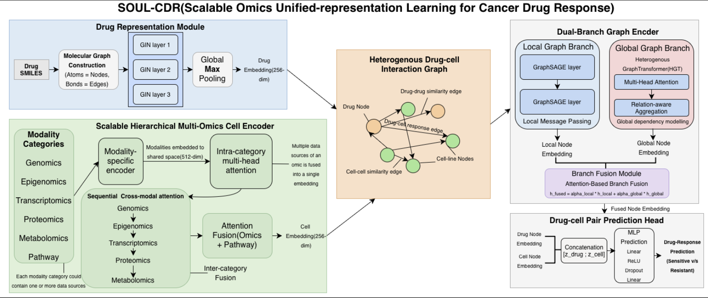

# SOUL-CDR (Scalable Omics Unified-representation Learning for Cancer Drug Response)

**Author:** Hrishikesh Kurapati  
**Institution:** IIIT Sri City  
**Guide/Supervisor:** Dr. Amilpur Santosh  

---

## 🚀 Overview

**SOUL-CDR** is a scalable heterogeneous graph learning framework designed to predict cancer drug responses. It achieves this by combining **hierarchical multi-omics fusion** with **dual-branch graph representation learning** (GraphSAGE and HGT), specifically modeling the intricate relationships between different omics layers, drugs, and cancer cell lines.

**Key Contributions:**
*   **Heterogeneous Graph Construction:** Explicitly models drug–drug, cell–cell, and drug–cell edges, bridging seen and unseen entities.
*   **Hierarchical Multi-Omics Fusion:** Employs a cross-modal sequential attention mechanism aligning with biological regulatory structures to fuse up to 6 omics modalities.
*   **Dual-Branch Encoder:** Merges local structural pattern recognition (GraphSAGE) with global long-range dependency modeling (Heterogeneous Graph Transformer).
*   **Supervised Contrastive Learning (SCL):** Increases representation robustness, pulling matching response pairs together and pushing mismatched pairs apart.

**🔥 Highlight Result:**
SOUL-CDR reaches an **AUC of 0.8316** on the benchmark dataset random split and sets a new state-of-the-art inductive performance, netting an **AUC of 0.6444** (a 12.46% relative improvement over GraphCDR and 31.51% over RedCDR) in the strictest "Unseen Both" setting.

---

## 📖 Problem Context

### What is Cancer Drug Response Prediction (CDRP)?
CDRP is a core challenge in precision oncology. The goal is simple: given a specific **cancer cell line** and a **drug molecule**, predict the therapeutic sensitivity (e.g., sensitive or resistant, measured traditionally via metrics like IC50). 

### Why It Matters
Identifying effective drugs for individual patients accelerates drug discovery and supports personalized treatment strategies. However, existing methods struggle due to noisy high-dimensional multi-omics data, the complex heterogeneous nature of biological graphs (i.e. treating cells and drugs identically), and importantly, severely degraded generalization when predicting for completely novel drugs or cell lines (the inductive setting).

---

## 🗺️ Project Roadmap

*   [x] **Phase 1:** Representation learning
*   [x] **Phase 2 (Latest Completed):** Graph modeling + contrastive learning
*   [ ] **Phase 3:** Explainability
*   [ ] **Phase 4:** Clinical validation

---

## 🏗️ Architecture



1.  **Drug Representation Learning:** Uses Graph Isomorphism Networks (GIN) to process SMILES-derived molecular graphs into compact 256-dimensional embeddings.
2.  **Cell Representation Learning:** Utilizes intra-category attention to compress single omics features, followed by sequential cross-modal attention bridging Genomics $\rightarrow$ Epigenomics $\rightarrow$ Transcriptomics $\rightarrow$ Metabolomics $\rightarrow$ Proteomics $\rightarrow$ Pathway activity.
3.  **Heterogeneous Graph Construction:** Integrates independent embeddings into a unified multi-relational graph via top-10 cosine similarities (cell-cell and drug-drug), establishing communication bridges during prediction.
4.  **Dual-Branch Graph Encoder:** GraphSAGE effectively samples node neighborhoods to understand local clusters while the Heterogeneous Graph Transformer (HGT) attends to distinct relation types and long-scale distances. 

---

## 💻 Getting Started

This repository provides all code required to reproduce experimental setups, evaluate baselines, and develop further upon SOUL-CDR.

### 1. Requirements

Ensure you are running Python 3.6+ and PyTorch 1.4+.

```bash
# Clone the repository
git clone https://github.com/yourusername/SOUL-CDR.git
cd SOUL-CDR

# Install dependencies
pip install -r requirements.txt
```
*(Key dependencies include PyTorch Geometric, DeepChem, Mordred, ogb, and standard scientific libraries)*

### 2. Execution Commands

Run the model on the scalable setup:
```bash
python "scalable model/main_scalable.py" 
# or via shell script for specific configs
cd "scalable model"
bash run_scalable_selected_configs.sh
```

Run benchmarks on the 3-omics dataset (comparing SOUL-CDR, GraphCDR, RedCDR):
```bash
cd 3OmicsBenchmarking

# Run specific inductive evaluations
python run_unseen_both.py
python run_unseen_cells.py
python run_unseen_drugs.py
```

---

## 📁 Project Structure

*   `3OmicsBenchmarking/` - Full benchmarking pipeline, data logic, and scripts for SOUL-CDR and baselines on the 3-omics dataset.
*   `scalable model/` - Core implementation code of the multi-omics SOUL-CDR framework.
*   `benchmark models/` - Re-implementations / wrappers around baseline models (GraphCDR, RedCDR).
*   `benchmarking_common/` - Shared hyperparameter tuning, model wrappers, and shared training logic.
*   `data/` & `final_dataset/` - Raw inputs (CCLE, GDSC, SMILES, etc.) and fully processed intermediate graphs and omics tables.
*   `Research paper/` - Complete LaTeX source code, resulting PDFs, and plotting scripts for figures. 

---

## 📊 Data Pipeline

Data flows from broad external repositories down directly to model inputs:
1.  **Sources:** Integrated primarily from **CCLE (DepMap)** and **GDSC1**. 
2.  **Omics Preprocessing:** Missing values are imputed using KNN ($k=5$). We reduce dimensionality effectively by eliminating features with a VarianceThreshold $< 0.03$. GSVA mapping isolates pathway scores against MSigDB Hallmark gene sets. 
3.  **Drug Preprocessing:** SMILES translate into computational molecular graphs using DeepChem, while global physicochemical attributes are extracted using Mordred and standardized via z-score.

---

## 🔬 Experimental Setup

We evaluate SOUL-CDR across multiple setups, designed around rigorous clinical evaluation norms:

*   **Custom 7-Modalities Dataset:** Used largely for model development and architecture validation (425 cells, 298 drugs).
*   **Custom 3-Omics Dataset & GraphCDR Benchmark:** Strict unified benchmark datasets to conduct fair comparisons representing Mutation, Expression, and Methylation data. 
*   **Evaluation Protocol:** 5-fold cross-validation. We break splits down by:
    *   **Random Split:** Classic performance measurement.
    *   **Unseen Cells / Unseen Drugs:** One group is completely novel.
    *   **Unseen Both:** Strict inductive split where the evaluation pairings have no entities overlapping the training set.
*   **Metrics:** Main metrics relied upon are AUC (Area Under the Receiver Operating Characteristic Curve) and AUPR (Area Under the Precision-Recall Curve).

---

## 📈 Results

| Model | Setting | AUC | AUPR |
| :--- | :--- | :--- | :--- |
| **GraphCDR** | Random (Benchmark)* | 0.8309 $\pm$ 0.0045 | 0.4733 $\pm$ 0.0098 |
| **RedCDR** | Random (Benchmark)* | 0.8355 $\pm$ 0.0027 | 0.4914 $\pm$ 0.0061 |
| **SOUL-CDR** | Random (Benchmark)* | **0.8316 $\pm$ 0.0024** | **0.4774 $\pm$ 0.0072** |

*\*Benchmark Random setup indicates competitive predictive matching across identical data splits*

**Key Takeaways:**
*   **Unmatched Inductive Performance:** In the hardest experimental bracket (Unseen Both), SOUL-CDR dominates the prior state-of-the-art baselines by a large margin (31.51% relative AUC vs RedCDR).
*   **Resiliency to Modalities:** The flexible hierarchical design allows models to be built purely from 1 Modality (Pathway info) or directly expand up to a 6 Modality super-stack with static computational overhead.

---

## 📚 Baselines / References

SOUL-CDR was systematically modeled and benchmarked against the following foundational GNN structures for CDRP:
*   [GraphCDR](https://github.com/liuxuan666/GraphCDR)
*   [RedCDR](https://github.com/mhxu1998/RedCDR)

---

## 💡 Key Insights

*   **Pathway Summarization Wins:** Evaluating multi-omics independently revealed that deriving high-level Pathway activity scores serves as the most potent signal relative to throwing unstructured omics into dense layers.
*   **Contrastive regularizations stabilize embeddings:** During severe class-imbalance, the Supervised Contrastive Learning objective prevents representational collapse, proving decisive upon unseen nodes. 
*   **Global interactions limit locality:** Only testing against immediate neighbored graphs limits model potential. Combining GraphSAGE (local) with an HGT (global) solves graph saturation without overfitting.

---

## 🔮 Future Work

*   **Explainability:** Tracing predictions backwards through the cell-encoder to identify which specific pathways or biological omics triggered therapeutic sensitivities.
*   **Clinical Validation:** Projecting the algorithm toward heavily in-vivo or clinical trial datasets bypassing strictly cell-line distributions.
*   **Additional Biological Networks:** Constructing richer heterogeneous edges beyond raw structural and biological pathways. 

---

## 📄 License & Citation

Licensed under **MIT License**.
*(If you found this software useful in your research, consider citing the upcoming SOUL-CDR publication once archived.)*